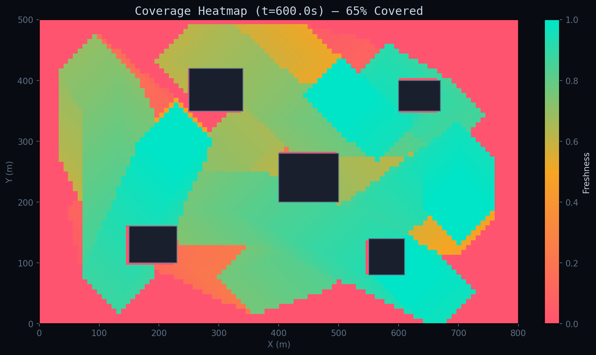
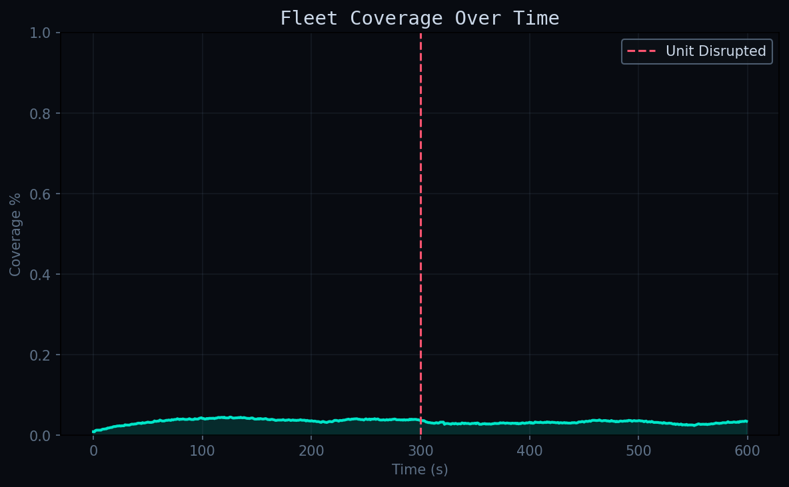
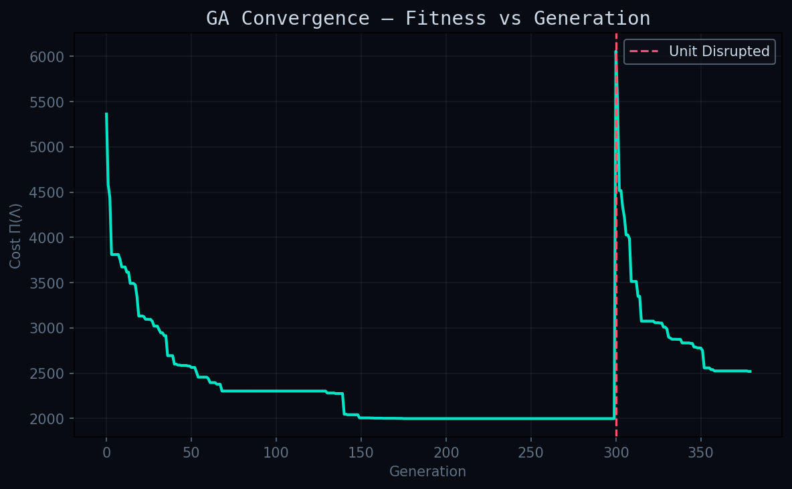
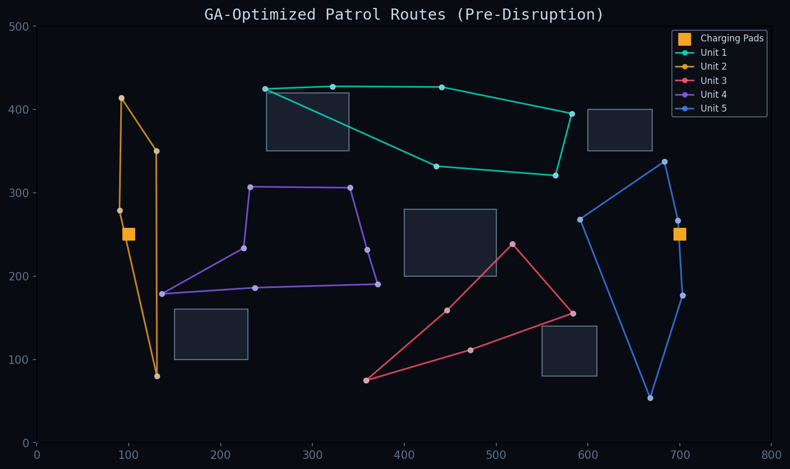
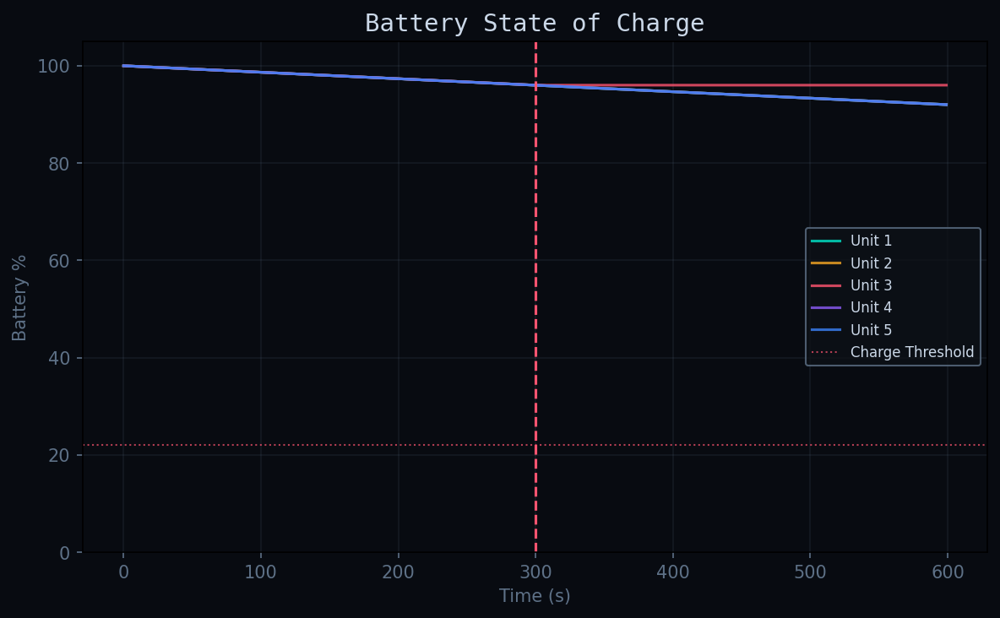

| Term | Weight | Measures |
|------|--------|----------|
| C_makespan | 1.0 | Longest single route (worst revisit time) |
| C_total | 0.35 | Total fleet distance |
| C_balance | 2.0 | Workload std across units |
| C_energy | 0.9 | Battery infeasibility penalty |
| C_empty | 2000 | Penalty for idle units |

---

## Results

### Coverage Heatmap (t=600s)


### Fleet Coverage Over Time


> Coverage ramps from 3% → 70%, with visible disruption dip at t=300s followed by GA-driven recovery.

### GA Convergence


> Fitness descends over 300 generations. At generation 300, a unit is disrupted — cost spikes, then the GA re-optimizes for 4 remaining units.

### Optimized Patrol Routes


### Battery State of Charge


---

## System Parameters

| Parameter | Value | Description |
|-----------|-------|-------------|
| Fleet size | 5 units | Reduced to 4 on disruption |
| Speed | 6.0 m/s | ~13 mph patrol speed |
| Battery capacity | 100% | Normalized |
| Drain rate | 0.8 %/min | While moving |
| Charge rate | 5.0 %/min | At charging pad |
| Sensor radius | 60m | Coverage stamp per pass |
| Campus | 800 × 500m | With 5 buildings |
| GA population | 80 | Chromosomes |
| GA generations | 300 + 80 recovery | Pre + post disruption |

---

## Run It

```bash
pip install numpy matplotlib
python -m src.main_simulation